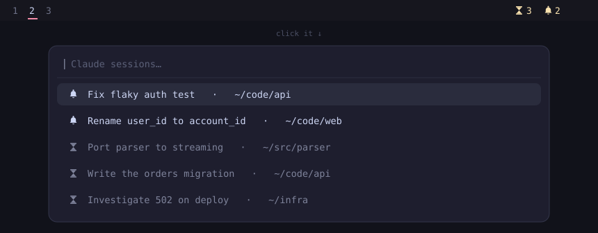

# waybarclaude

**You have eleven Claude Code sessions open. Which one wants you next?**

A waybar module that answers that at a glance, and a picker that takes you
straight there.



The bar shows two numbers: **sessions still working**, and **sessions that
finished and are waiting on you**. It goes amber the moment something needs you,
and disappears entirely when nothing does.

Click it and you get your launcher in dmenu mode, listing the waiting sessions
first and the running ones underneath — each labelled with the actual title
Claude gave that session, so you're choosing between *"Fix flaky auth test"* and
*"Port parser to streaming"*, not between eleven identical terminal windows.

Pick one: it focuses that window and drops the entry.

## Why you'd want this

Claude Code already fires a desktop notification when a session finishes, and
clicking it focuses the right window. That works beautifully for one session.

At ten sessions it stops working, because notifications are **transient**. You
step away, six of them finish, the toasts expire, and now you're alt-tabbing
through a wall of terminals reading each one to figure out which still needs you.

This turns those notifications into a **queue that persists until you actually
deal with each session** — and a running count so you know how much is still
in flight.

## What clears an entry

Everything you'd expect, so the queue never lies to you:

- you pick it from the menu
- **you visit that window any other way** — the notification, a keybind, alt-tab, the mouse
- the session starts working again
- the session exits, or its window closes
- a turn that finishes while you're *already looking at that window* never queues at all

## Install

```sh
git clone https://github.com/naomarik/waybarclaude
cd waybarclaude
./install.sh --wire
```

`--wire` makes the two waybar edits for you, with backups. Leave it off and it
prints them instead. Then reload waybar and check:

```sh
claude-queue doctor
```

The installer writes only inside your home directory, never uses sudo, and backs
up anything it would overwrite that it didn't write itself.

<details>
<summary><b>What gets installed, and the two edits that can't be automated</b></summary>

| Path | What |
|---|---|
| `~/.local/bin/claude-queue` | the whole tool, one script |
| `~/.config/waybar/claude-queue.jsonc` | module definition, pulled in via waybar's `include` |
| `~/.config/waybar/claude-queue.css` | styling, pulled in via CSS `@import` |
| `~/.config/systemd/user/waybarclaude.service` | the event daemon |
| `~/.config/hypr/waybarclaude.conf` | `exec-once` fallback for non-systemd setups |

waybar can define a module from an included file but **cannot append to a
`modules-*` array** from one, so these two are yours (or use `--wire`):

```jsonc
// ~/.config/waybar/config.jsonc
"include": ["~/.config/waybar/claude-queue.jsonc"],
"modules-right": [ ..., "custom/claude-queue" ],
```

```css
/* first line of ~/.config/waybar/style.css */
@import "claude-queue.css";
```

**Tip:** put the module at the **end of `modules-left`**, after your workspace
list. It hides itself when there's nothing to report, and at that position
appearing and disappearing shifts nothing else on the bar.

Three of the installed files ship with an `@BIN@` placeholder that the installer
replaces with the real path to `claude-queue`, so the module and the systemd unit
don't depend on waybar or systemd inheriting your `PATH`. Substitute it yourself
if you copy them by hand.

</details>

## Requirements

- **Hyprland** — the compositor-specific code is four functions at the top of
  `bin/claude-queue`; a Sway port would reimplement those against `swaymsg`
- **waybar**, bash 5, `jq`, `socat`, `inotify-tools`
- a dmenu-capable launcher — `walker`, `fuzzel`, `rofi`, `wofi`, `tofi`,
  `bemenu` or `dmenu`, auto-detected in that order
- a Nerd Font in your bar, for the default icons

```sh
# Arch
sudo pacman -S --needed jq socat inotify-tools
# Debian/Ubuntu
sudo apt install jq socat inotify-tools
```

## How it works

**No Claude Code hooks.** Claude Code keeps a roster at
`~/.claude/sessions/<pid>.json` and rewrites a session's file on every status
transition (`busy` ↔ `idle`). An inotify watch on that one directory is enough to
know when every turn starts and ends.

That matters for safety: this tool never writes under `~/.claude`, never signals a
session, and never touches a session's messaging socket. It is **read-only
observation**, so it cannot disturb a session you have running.

### The interesting part: which window is this session in?

Terminals like Ghostty run every window in **one process**. All eleven of your
windows report the same PID, so there is no way to get from a session to its
window through the process tree. Two mechanisms cover it:

**1. Transcript title match (primary).** Claude records the terminal title it set
for a session as `aiTitle` in the session transcript. The live window title is
that same string behind a status marker — `✳ Fix flaky auth test` when idle, a
braille spinner while busy. Matching the two identifies the window *exactly*, and
works for sessions that were already running long before the daemon started.

**2. Focus at turn start (fallback).** If a session has no title yet, the window
focused at the instant a turn begins is its window — because you just pressed
enter in it.

A session lives in one window for its whole life, so the first binding wins, and a
window already claimed by another live session is never stolen.

## Configuration

Copy `~/.config/waybarclaude/config.example` to
`~/.config/waybarclaude/config`. It's sourced by bash; set only what you want to
change.

| Key | Default | Notes |
|---|---|---|
| `TERMINAL_CLASSES` | ghostty, alacritty, kitty, foot, … | window app-ids that may host a session |
| `WAYBAR_SIGNAL` | `14` | must match `signal` in the `.jsonc`, and not collide with your other modules |
| `ICON_RUNNING` / `ICON_WAITING` | `󰔟` / `󰂚` | Nerd Font glyphs — plain Unicode like `✳` often has no coverage in bar fonts |
| `MENU` | auto | force a launcher by name, or give a full command line |
| `MENU_WIDTH`, `MENU_LINES`, `MENU_PROMPT` | | picker appearance |
| `CLAUDE_DIR` | `~/.claude` | |

Find your terminal's class with
`hyprctl clients -j | jq -r '.[].class' | sort -u`.

## Commands

```
claude-queue status     waybar JSON (what the module runs)
claude-queue menu       the picker
claude-queue watch      the event daemon (systemd runs this)
claude-queue list       the queue and the window bindings
claude-queue doctor     check dependencies and wiring
claude-queue clear      empty the queue
claude-queue unbind ID  forget a session's window so it can be re-learned
claude-queue sync       prune dead sessions and closed windows
```

## What it costs

Four processes, every one of them **blocked on a read**. Nothing polls, and there
is no timer anywhere: the shell, a supervisor subshell, `socat` on Hyprland's
event socket, and `inotifywait` on the roster directory.

Measured across the whole process tree over 60s of normal desktop use:

| | |
|---|---|
| CPU | **1 jiffie — 0.017% of one core** |
| RSS | 18.6 MiB combined, mostly shared bash text |

Hyprland re-emits focus events constantly, so the daemon *does* wake often, but
each wake is shell string operations against a one-line cache file. A subprocess
is forked only when the queue actually changes. The bar module is signal-driven
(`interval: once` + `signal`), so it runs when something happens rather than on a
timer.

## Limitations

- **One session per window.** Two sessions in tabs or splits of the same window
  collapse to one address: focusing the window works, picking the right tab
  doesn't.
- **Hyprland only** for now.
- A session that has never produced a title *and* was never focused at a turn
  start will queue without a known window. It still shows and still counts;
  selecting it just clears it. `claude-queue list` shows which bindings are
  missing.
- The roster is Claude Code's internal state, not a documented API. It's been
  stable in practice, but a future version could change it — `claude-queue
  doctor` will tell you if it stops parsing.

## Uninstall

```sh
./uninstall.sh              # shows the plan, asks, then removes
./uninstall.sh --dry-run    # just show the plan
./uninstall.sh --purge      # also delete the queue state
```

Deliberately paranoid, because uninstallers that guess are how people lose
configs. It touches only an explicit list of paths, refuses to delete any file
that doesn't carry the `waybarclaude:managed` marker, skips symlinks and anything
outside `$HOME`, backs up your waybar config before un-wiring it, and uses
`rmdir` rather than `rm -rf` on the state directory — so anything unexpected in
there **blocks** the deletion instead of being destroyed.

Verified by installing into a throwaway tree and tearing it down: afterwards the
waybar config was byte-identical to the original.

## Tests

```sh
./test/e2e.sh
```

27 assertions covering every transition, the picker, and idle CPU. It runs the
real daemon against a scratch roster and a **fake compositor event socket**, so
focus events are deterministic and nothing touches your real `~/.claude` or your
real queue. Needs Hyprland running with at least three windows of the same class
open.

## License

MIT
